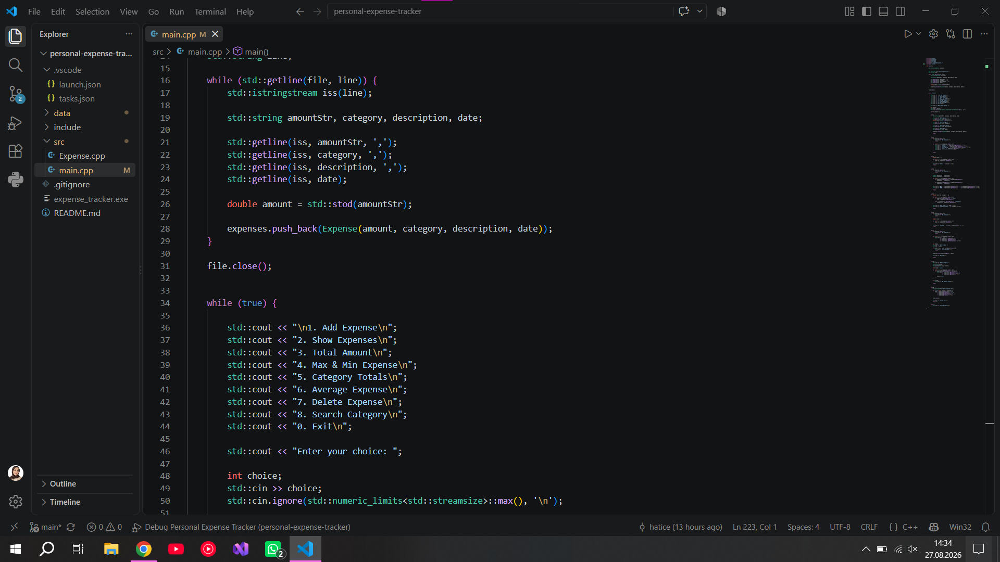
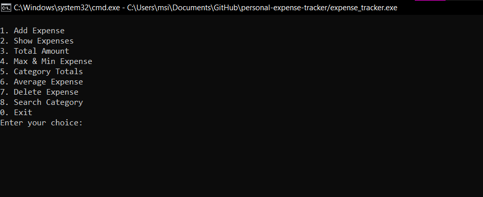
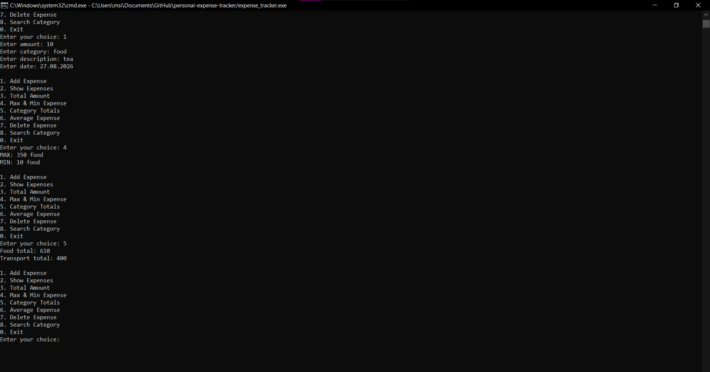
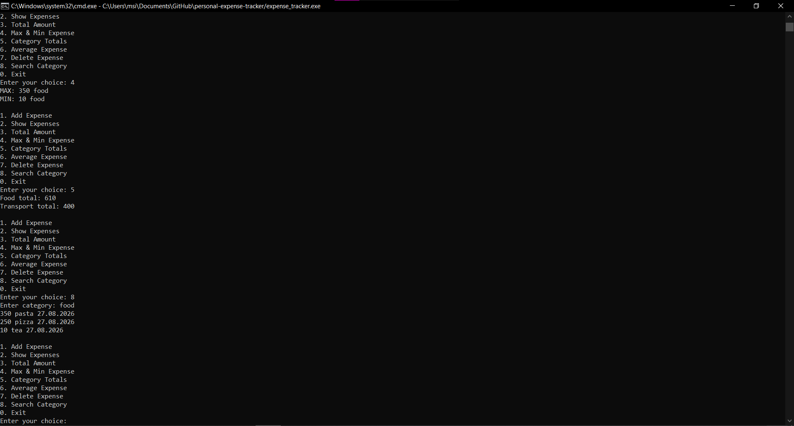

# 💰 Personal Expense Tracker (C++)

A simple console-based application to track personal expenses.

This project was built to practice C++ fundamentals, file handling, and basic application logic.

---

## 🚀 Features

- Add new expenses
- View all expenses
- Calculate total spending
- Find maximum and minimum expense
- Calculate average expense
- Category-based totals (e.g. food, transport)
- Search expenses by category
- Delete expense by index
- Save & load data from file

---

## 🧠 What I Learned

While building this project, I practiced:

- C++ basics
- Object-Oriented Programming (using classes)
- STL (`vector`)
- File handling (`ifstream`, `ofstream`)
- Parsing data with `stringstream`
- Building menu systems using `while` and `switch`

---

## 💾 Data Storage

Expenses are stored in a file:

data/expenses.txt

Format:

amount,category,description,date

Example:

250,food,coffee,12.08.2026

---

## ▶️ How to Run

### Compile

g++ src/main.cpp src/Expense.cpp -o app

### Run

./app

(Windows users can use `app.exe`)

---

## 📸 Screenshots

### Project Overview (VS Code)

### Main Menu

### Add Expense / Interaction 1

### Expense Operations / Result

---

## 📌 Future Improvements

- Improve UI/UX
- Add monthly reports
- Add more categories dynamically
- Use a real database (SQLite)

---

## 👩‍💻 Author

Developed as a learning project to improve C++ skills and problem-solving.

